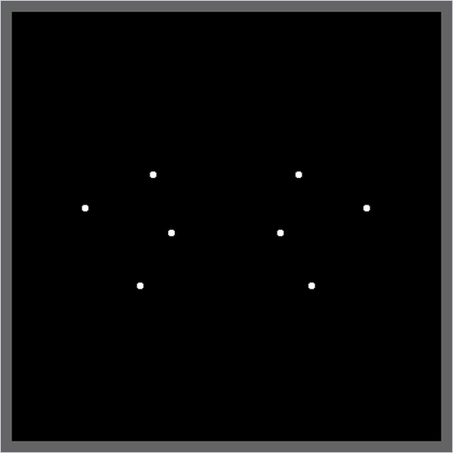

<div align="center">

# Geometry Viewer 3D

*A small 3D point viewer built on hand-written vector and matrix classes, with a perspective camera you can fly and turn.*




</div>

## About

The first step of a descriptive-geometry viewer, written from scratch. `vectors.py` implements 2D, 3D and n-dimensional vectors and matrices, including rotation matrices, without NumPy. `render3D.py` uses them for a perspective camera that draws into a 400 × 400 viewport inside the Pygame window. The sample scene in `main.py` is the eight corners of a box, drawn as dots, which you can fly around and look at from any angle.

## Quick start

```bash
python -m pip install -r requirements.txt
python main.py
```

## Controls

| Input | Action |
| --- | --- |
| <kbd>W</kbd> / <kbd>S</kbd> | Move forward / backward along the view direction |
| <kbd>A</kbd> / <kbd>D</kbd> | Move left / right |
| <kbd>Left Shift</kbd> / <kbd>Left Ctrl</kbd> | Move up / down along the camera's own up axis |
| <kbd>←</kbd> / <kbd>→</kbd> | Turn left / right |
| <kbd>↑</kbd> / <kbd>↓</kbd> | Tilt up / down |
| Hold any mouse button and drag | Rotate the view, so that the scene follows the mouse |
| Close the window | Quit |

## How it works

- **Linear algebra from scratch.** In `vectors.py` the `*` operator is overloaded: vector times vector is the dot product, vector times `Matrix` multiplies a row vector by the matrix, and vector times number scales. A matrix is indexed with -1 as a wildcard, so `m[-1, j]` is column $j$ and `m[i, -1]` is row $i$, and the matrix product is built from dot products of rows and columns. `Matrix.rotation_3D(axis, angle)` returns the rotation matrix about x, y or z for an angle in degrees.
- **Camera space.** The camera has a position $\mathbf c$, a yaw $\psi$ about the z axis and a pitch $\theta$ about the y axis. A point is moved into camera space as a row vector:

  ```math
  \mathbf p_c = (\mathbf p - \mathbf c)\,R_z(-\psi)\,R_y(-\theta)
  ```

- **Perspective projection.** Points with $x_c \le 0$ are behind the camera and are skipped. The rest are divided by their depth. The screen distance $d$ comes from a 120° field of view across the 400 px viewport, about 115.5 px:

  ```math
  d = \frac{s/2}{\tan(\mathrm{FOV}/2)},\qquad (u,\,v) = \frac{d}{x_c}\,(y_c,\; z_c)
  ```

  Here $(u, v)$ is measured from the viewport centre with $v$ pointing up. The renderer works with y up throughout and flips to Pygame's y-down coordinates only when drawing (`to_pygame_coordinates`).
- **Movement.** Key presses add a unit vector to a movement vector and key releases subtract it, so opposite keys cancel. Each frame the vector is rotated by the camera's pitch and yaw into world space, and the camera moves 0.01 units along it.
- **Turning.** Each frame the rotation grows by (mouse motion × button held + arrow keys) / 10 degrees. The arrow keys therefore turn the camera by 0.1° per frame, and dragging turns it by 0.1° per pixel.

## Code map

| Path | Role |
| --- | --- |
| `vectors.py` | `Vector2`, `Vector3`, `VectorN` and `Matrix`, the unit vectors and the rotation matrices |
| `render3D.py` | `Render3D`: camera state, input handling, projection and drawing into the viewport |
| `main.py` | Opens the 800 × 800 window and draws the eight corners of a box every frame |

## Limitations

- Only points are drawn, and the scene is hard-coded in `main.py`. `draw_line` is unfinished: it uses an undefined variable `position`, so it would raise `NameError`, and nothing calls it.
- Projected points are not clipped to the viewport. A point in front of the camera but outside the 120° field of view is drawn on the grey area around it.
- Camera-space y is drawn to the right while x points forward and z up, so the picture is the mirror image of a right-handed scene.
- Movement and turning are fixed steps per frame and the loop has no `Clock.tick`, so speed depends on the machine and one CPU core stays busy.
- Only `Vector3` can be multiplied by a matrix. `Vector2` fails because it tries to scale its components by a `VectorN` column, and `VectorN` indexes the class `Matrix` instead of the argument. `VectorN.__str__` is also broken: it calls the component list as if it were a function. Because -1 is the wildcard index, the last row or column of a matrix cannot be reached as `-1`.

## Background

Written between 13 November and 4 December 2024, according to the git history, in a folder named `diedrico`. That is the Spanish name for the dihedral (Monge) projection system of descriptive geometry. Only the 3D view was built.

---

<div align="center"><sub>Part of <a href="https://github.com/lnivan">lnivan's projects</a> · <b>Graphics</b></sub></div>
