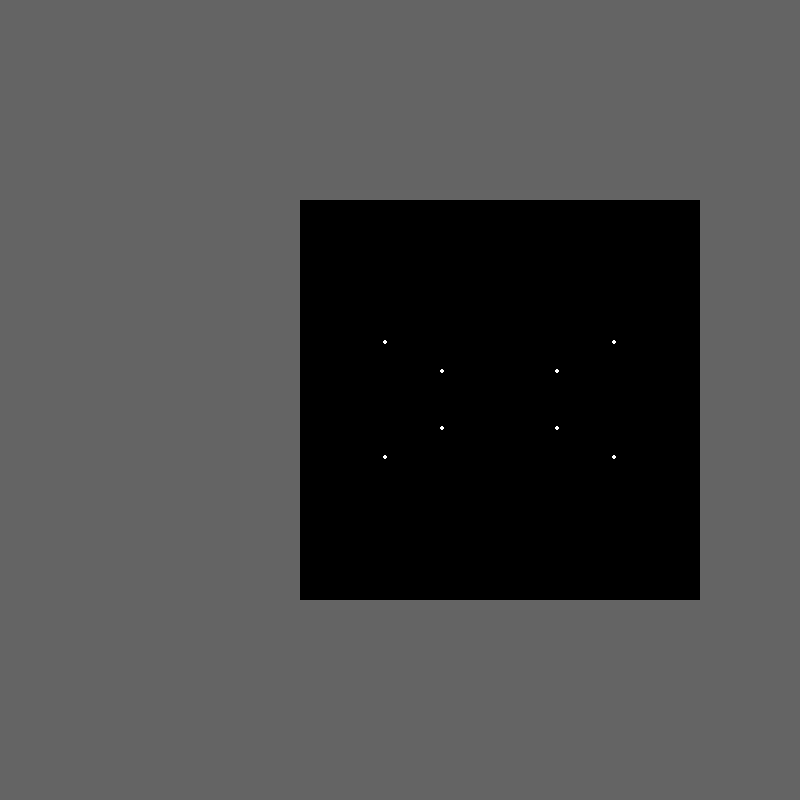

# Geometry Viewer 3D

An interactive 3D geometry viewer built from custom vector, matrix and projection code.



## What it contains

- Custom 2D, 3D and N-dimensional vector classes.
- Matrix rotations and camera-coordinate projection.
- An interactive viewport showing the vertices of a box.

## Setup

Use Python 3.12. From the repository folder:

```bash
python -m venv .venv
# Windows PowerShell: .venv\Scripts\Activate.ps1
# macOS / Linux: source .venv/bin/activate
python -m pip install -r requirements.txt
python main.py
```

## Controls

W / A / S / D move the camera, left Shift / Ctrl move vertically, and arrow keys rotate. Holding a mouse button also enables rotation.

## Project status

An early geometry and rendering experiment. The sample scene is defined directly in main.py.

## Project collection

Part of [lnivan's projects](https://github.com/lnivan), under **Math**.
